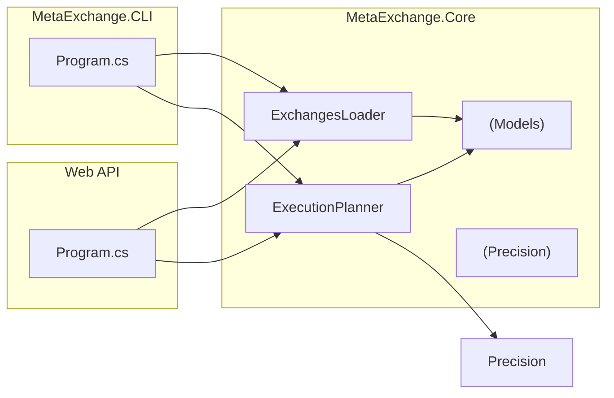
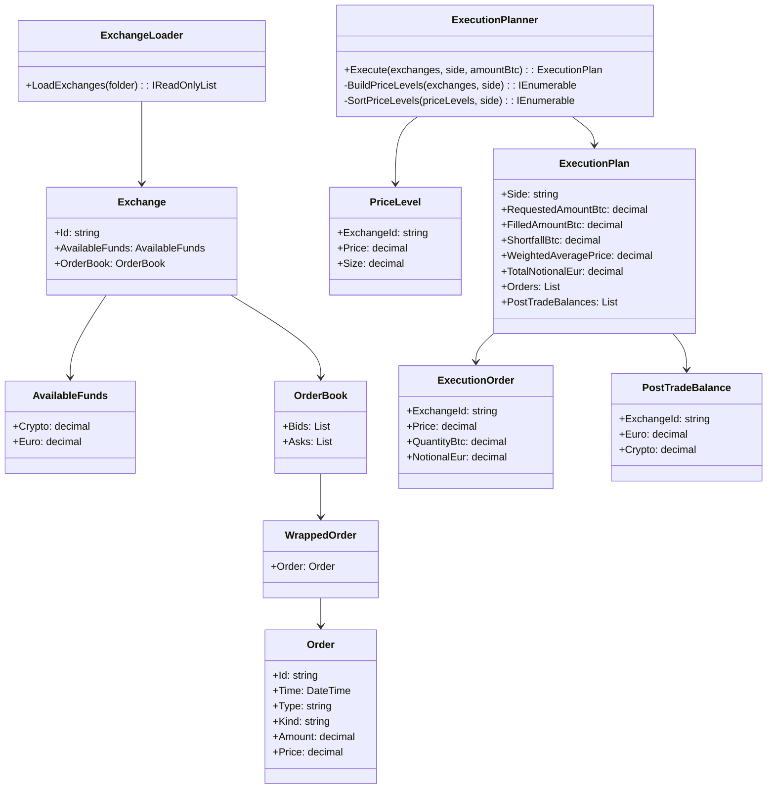

# MetaExchange

This solution calculates the best way to execute a BTC buy or sell order across multiple exchanges. 
In finance, this type of system is often called a Smart Order Router (SOR). 
This implementation focuses on the core logic combining order books, respecting balances, and producing an execution plan.

This project includes:
- A **Console App** for batch execution (`MetaExchange.Cli`)
- A **Core Library** containing the execution algorithm (`MetaExchange.Core`)
- A **Minimal Web API** (`MetaExchange.WebApi`)
- **Orderbooks** containing sample JSON inputs

## Features
- Reads multiple exchange **order book JSON files**.
- Optimizes trades:
  - **BUY** at lowest prices first.
  - **SELL** at highest prices first.
- Respects per-exchange limits:
  - EUR balance for buys,
  - BTC balance for sells.
- Outputs a detailed **execution plan**:
  - Orders to place per exchange,
  - Weighted average price,
  - Updated post-trade balances.
- Console and Web API share the exact same core algorithm
- Web API that can be run locally in Docker container.

## Folder Structure
```
MetaExchange/
|-- README
|-- docker-compose.yaml
|
|-- orderbooks/ # Input JSON files
|	|-- exchange-01.json
|	|-- exchange-02.json
|
|-- src/
|	|-- MetaExchange.CLI/ # Console App
|	|-- MetaExchange.Core/ # Core logic and models
|	|-- MetaExchange.WebApi/ # Minimal  Web API
|		|-- Dockerfile
|
```

## Example Input JSON Files
Example: `orderbooks/exchange-01.json`
```json
{
	"Id": "Binance",
	"AvailableFunds": {
		"Crypto": 0.5,
		"Euro": 10000.0
	},
	"OrderBook": {
		"Bids": [
			{
				"Order": {
					"Price": 25000.00,
					"Amount": 0.4
				}
			}
		],
		"Asks": [
			{
				"Order": {
					"Price": 25100.00,
					"Amount": 0.2
				}
			}
		]
	}
}
```

## How to Run
### Console App
From the CLI project folder:
```bash
cd src/MetaExchange.CLI

# Output in Console
dotnet run ../../orderbooks BUY 1.0
```

#### Usage
```bash
MetaExchange.CLI <orderbooksFolder> <BUY|SELL> <amountBtc> [outputJsonPath]
```

| Argument					| Description							|
|:--------------------------|:--------------------------------------|
| `<orderbooksFolder>`		| Folder containing JSON files.			|
| `<BUY>` or `<SELL>`		| Type of order (Buy or Sell).			|
| `<amountBtc>`				| Total BTC to trade.					|
| `[outputJsonPath]`		| JSON file to save output (*optional*)	|

Example (save result):
```bash
# Output in File
dotnet run ../../orderbooks BUY 1.0 result.json
```

## Web API (No Docker)
You can run the Web API directly from your development environment

```bash
# Navigate to the Web API project
cd src/MetaExchange.WebApi

# Run the Web API
dotnet run
```

The API listens on:
```bash
http://localhost:5257
```

### The available endpoints
- Health check: `GET /health`
  cURL Example:
  ```bash
  curl http://localhost:5257/health
  ```

- Execute Best Plan: `POST /execute/{side}/{amountBtc}`
  cURL Example:
  ```bash
  # BUY
  curl -X POST http://localhost:5257/execute/BUY/0.405
  
  # SELL
  curl -X POST http://localhost:5257/execute/SELL/0.25
  ```

## Web API (Docker container)
Run the Web API using Docker
```bash
docker compose down --remove-orphans
docker compose up --build
```

Access the endpoints:
- Health check: `GET /health`
  cURL Example:
  ```bash
  curl http://localhost:5000/health
  ```
- Execute Best Plan: `POST /execute/{side}/{amountBtc}`
  cURL Example:
  ```bash
  # BUY
  curl -X POST http://localhost:5000/execute/BUY/0.405
  
  # SELL
  curl -X POST http://localhost:5000/execute/SELL/0.25
  ```

**NOTE**
If logs show `Now listening on: http://[::]:8080`, ensure that your `docker-compose.yaml` maps host port **5000** to container port **8080**_
```yaml
porst:
	- "5000:8080"
```

## Quick Testing Using `.http` File
A `MetaExchange.WebApi.http` file is provided at the `MetaExchange.WebApi` folder to make testing easier.

** Example content:**
```http
### Health Check
GET http://localhost:5000/health

### Buy 0.05 BTC
POST http://localhost:5000/execute/BUY/0.05

### Sell 0.015 BTC
POST http://localhost:5000/execute/SELL/0.015
```

**How to use:**
- Open the `MetaExchange.WebApi.http` file in **Visual Studio** or **Visual Studio Code** or **JetBrains Rider**.
- Make sure the Web API is running locally (via `dotnet run` or Docker).
- Adjust the port (`5000`) in the `.http` file if you are using a different port.
- Click **"Send Request"** next to each call to run it directly from your editor.

This is a fast, lightweight alternative to Postman or curl.

## UML Diagrams
1. Architecture Overview: shows how the Console App use the core logic.


2. Sequence Diagram

	- BUY Flow: shows what happens when a BUY order processed.
	```mermaid
	sequenceDiagram
		autonumber
		participant User
		participant Client as Console/Web API
		participant Loader as ExchangeLoader
		participant Planner as ExecutionPlanner
 
		User->>Client: Request BUY 1.0
		Client->>Loader: Load JSON order books
		Loader-->>Client: List of Exchanges
		Client->>Planner: Execute(exchanges, BUY, 1.0)

		Note over Planner: Build price levels from all exchanges' <br/>ASKS (sellers)
		Planner->>Planner: Filter invalid price levels (price <= 0 or size <= 0)
		Planner->>Planner: Sort asks by price ASC (cheapest first)
 
		loop For each ask level (exchangeId, price, levelSize)
			Note over Planner: Compute feasible quantity at this level
			Planner->>Planner: maxByMoney = eurDict[exchangeId] / price
			Planner->>Planner: cappedQuantityRaw = min(remaining, <br/>levelSize, maxByMoney)
			Planner->>Planner: cappedQuantity = FloorToStep(cappedQuantityRaw, 0.00000001) %% BTC precision (8dp)
 
			alt cappedQuantity > 0
				Planner->>Planner: lineNotional = FloorToStep(price * cappedQuantity, 8)
				Planner-->>Planner: Append ExecutionOrder(exchangeId, BUY, price, cappedQuantity, lineNotional)
				Note over Planner: Update per-exchange balances
				Planner->>Planner: eurDict[exchageId] -= lineNotional
				Planner->>Planner: btcDict[exchageId] += cappedQuantity
				Planner->>Planner: remaining -= cappedQuantity<br/>filled += cappedQuantity<br/>notional += lineNotional
			else cappedQuantity == 0
				Planner->>Planner: Skip this level
			end
 
			opt remaining == 0
				Planner->>Planner: break
			end
		end

		Planner->>Planner: WeighedAveragePrice = (filled > 0) ? notional / filled : 0
		Planner->>Planner: Build PostTradeBalances from eurDict[exchangeId], btcDict[exchangeId]
		Planner-->>Client: ExecutionPlan
		Client-->>User: Return JSON execution plan
	```

	- SELL Flow: shows what happens when a SELL order processed.
	```mermaid
	sequenceDiagram
		autonumber
		participant User
		participant Client as Console/Web API
		participant Loader as ExchangeLoader
		participant Planner as ExecutionPlanner
 
		User->>Client: Request SELL 1.0
		Client->>Loader: Load JSON order books
		Loader-->>Client: List of Exchanges
		Client->>Planner: Execute(exchanges, SELL, 1.0)

		Note over Planner: Build price levels from all exchanges' <br/>BIDS (buyers)
		Planner->>Planner: Filter invalid levels (price <= 0 or size <= 0)
		Planner->>Planner: Sort bids by price DESC (highest first)

		loop For each bid level (exchangeId, price, levelSize)
			Note over Planner: Compute feasible quantity at this level
			Planner->>Planner: maxByBtc = btcDict[exchangeId] %% Max BTC this exchange can sell
			Planner->>Planner: CappedQuantityRaw = min(remaining, levelSize, BTC balance)
			Planner->>Planner: cappedQuantity = FloorToStep(cappedQuantityRaw, 0.00000001) %% BTC precision (8 dp)

			alt cappedQuantity > 0
				Planner->>Planner: lineNotional = FloorToStep(price * cappedQuantity, 8)
				Planner-->>Planner: Append ExecutionOrder(exchangeId, SELL, price, cappedQuantity, lineNotional)
				Note over Planner: Update per-exchange balances
				Planner->>Planner: btcDict[exchangeId] -= cappedQuantity
				Planner->>Planner: eurDict[exchangeId] += lineNotional
				Planner->>Planner: remaining -= cappedQuantity<br/>filled += cappedQuantity<br/>notional += lineNotional
			else cappedQuantity == 0
				Planner->>Planner: Skip this level
			end

			opt remaining == 0
				Planner->>Planner: Break loop
			end
		end

		Planner->>Planner: WeighedAveragePrice = (filled > 0) ? notional / filled : 0
		Planner->>Planner: Build PostTradebalances from eurDict[exchangeId], btcDict[exchangeId]
		Planner-->>Client: ExecutionPlan
		Client-->>User: Return JSON execution plan
	```

3. Class Diagram 


## Precision (why it matters)
- BTC has **8 decimal places**. Orders beyond **8 dp** are invalid.
- Quantities are **floored** to 8 dp to prevent invalid order sizes.
- EUR amounts are also floored to 8 dp to avoid overstating spend or proceeds.
- Use `decimal` (not `double`) to prevent floating-point inaccuracies.

## Future Improvements
This project is intentionally kept **simple** to match the task requirements.
If it grows more complex, we can gradually introduce common architectural patterns:

| Pattern						| Purpose											|
|:------------------------------|:--------------------------------------------------|
| **Strategy Pattern**			| Cleanly separate BUY and SELL logic without `if` statements.	|
| **CQRS (Command & Handler)**	| Decouple input parsing and execution, useful for multiple UIs (CLI + Web API)	|
| **Repository Pattern**		| Abstract data source so exchanges could be loaded from APIs or databases instead of files	|
| **Dependency Injection (DI)**	| Manage dependencies more cleanly, especially as the systems grows.	|

## Summary
- **Console APP** and **Web API** share the same core algorithm.
- JSON files provide order book and balance data.
- **Simple, clear structure** with one main algorithm class.
- BUY and SELL execution plans handled cleanly.
- UML diagrams illustrate the architecture and flows.
- Future changes can adopt more advanced patterns as needed.