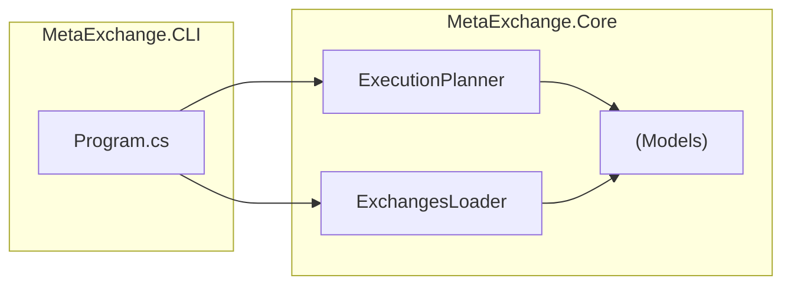
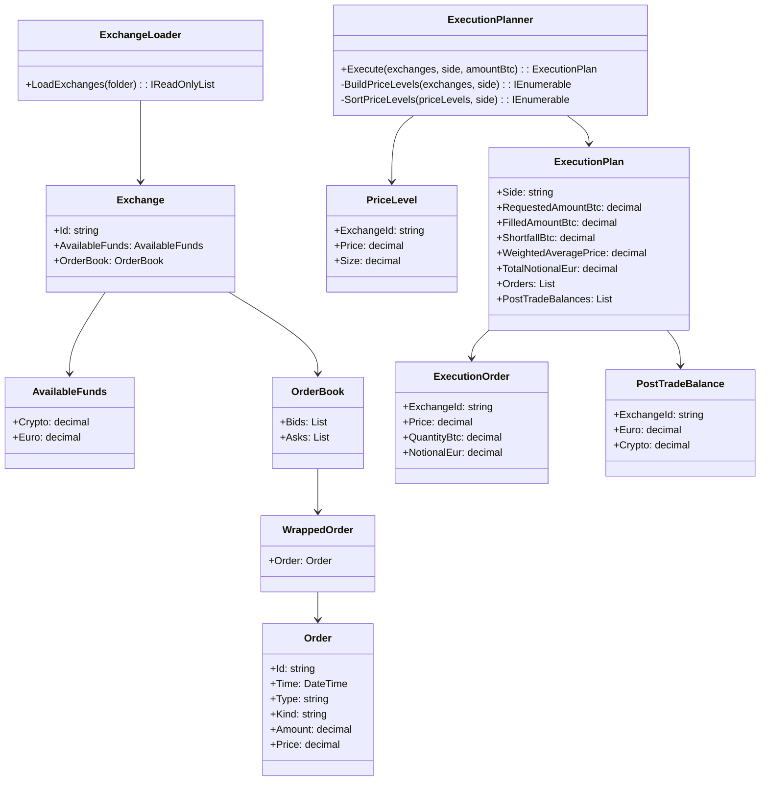

# MetaExchange

This solution calculates the best way to execute a BTC buy or sell order across multiple exchanges. 
In finance, this type of system is often called a Smart Order Router (SOR). 
This implementation focuses on the core logic combining order books, respecting balances, and producing an execution plan.

This project includes:
- A **Console App** for batch execution (`MetaExchange.Cli`)
- A **Core Library** containing the execution algorithm (`MetaExchange.Core`)

## Features
- Reads multiple exchange **order book JSON files**.
- Optimizes trades:
  - **BUY** at lowest prices first.
  - **SELL** at highest prices first.
- Respects per-exchange limits:
  - EUR balance for buys,
  - BTC balance for sells.
- Outputs a detailed **execution plan**:
  - Orders to place per exchange,
  - Weighted average price,
  - Updated post-trade balances.

## Folder Structure
```
MetaExchange/
|
|--- orderbooks/ # Input JSON files
| |--- exchange-01.json
| |--- exchange-02.json
|
|--- src/
| |--- MetaExchange.CLI/ # Console App
| |--- MetaExchange.Core/ # Core logic and models
```

## Example Input JSON Files
Example: `orderbooks/exchange-01.json`
```json
{
	"Id": "Binance",
	"AvailableFunds": {
		"Crypto": 0.5,
		"Euro": 10000.0
	},
	"OrderBook": {
		"Bids": [
			{
				"Order": {
					"Price": 25000.00,
					"Amount": 0.4
				}
			}
		],
		"Asks": [
			{
				"Order": {
					"Price": 25100.00,
					"Amount": 0.2
				}
			}
		]
	}
}
```

## How to Run
### Console App
```bash
cd src/MetaExchange.CLI

# Output in Console
dotnet run ../../orderbooks BUY 1.0

# Output in File
dotnet run ../../orderbooks BUY 1.0 result.json
```

#### Arguments
| Argument					| Description							|
|:--------------------------|:--------------------------------------|
| `<orderbooksFolder>`		| Folder containing JSON files.			|
| `<BUY>` or `<SELL>`		| Type of order (Buy or Sell).			|
| `<amountBtc>`				| Total BTC to trade.					|
| `[outputFile]`			| JSON file to save output (*optional*)	|


## UML Diagrams
1. Architecture Overview
This diagram shows how the Console App use the core logic.


2. Sequence Diagram

	- BUY Flow
	Shows what happens when a BUY order processed.
	```mermaid
	sequenceDiagram
		autonumber
		participant User
		participant Client as Console
		participant Loader as ExchangeLoader
		participant Planner as ExecutionPlanner
 
		User->>Client: Request BUY 1.0
		Client->>Loader: Load JSON order books
		Loader-->>Client: List of Exchanges
		Client->>Planner: Execute(exchanges, BUY, 1.0)

		Note over Planner: Build price levels from all exchanges' <br/>ASKS (sellers)
		Planner->>Planner: Filter invalid price levels (price <= 0 or size <= 0)
		Planner->>Planner: Sort asks by price ASC (cheapest first)
 
		loop For each ask level (exchangeId, price, levelSize)
			Note over Planner: Compute feasible quantity at this level
			Planner->>Planner: maxByMoney = eurDict[exchangeId] / price
			Planner->>Planner: cappedQuantityRaw = min(remaining, <br/>levelSize, maxByMoney)
			Planner->>Planner: cappedQuantity = FloorToStep(cappedQuantityRaw, 0.00000001) %% BTC precision (8dp)
 
			alt cappedQuantity > 0
				Planner->>Planner: lineNotional = FloorToStep(price * cappedQuantity, 8)
				Planner-->>Planner: Append ExecutionOrder(exchangeId, BUY, price, cappedQuantity, lineNotional)
				Note over Planner: Update per-exchange balances
				Planner->>Planner: eurDict[exchageId] -= lineNotional
				Planner->>Planner: btcDict[exchageId] += cappedQuantity
				Planner->>Planner: remaining -= cappedQuantity<br/>filled += cappedQuantity<br/>notional += lineNotional
			else cappedQuantity == 0
				Planner->>Planner: Skip this level
			end
 
			opt remaining == 0
				Planner->>Planner: break
			end
		end

		Planner->>Planner: WeighedAveragePrice = (filled > 0) ? notional / filled : 0
		Planner->>Planner: Build PostTradeBalances from eurDict[exchangeId], btcDict[exchangeId]
		Planner-->>Client: ExecutionPlan
		Client-->>User: Return JSON execution plan
	```

	- SELL Flow
	Shows what happens when a SELL order processed.
	```mermaid
	sequenceDiagram
		autonumber
		participant User
		participant Client as Console
		participant Loader as ExchangeLoader
		participant Planner as ExecutionPlanner
 
		User->>Client: Request SELL 1.0
		Client->>Loader: Load JSON order books
		Loader-->>Client: List of Exchanges
		Client->>Planner: Execute(exchanges, SELL, 1.0)

		Note over Planner: Build price levels from all exchanges' <br/>BIDS (buyers)
		Planner->>Planner: Filter invalid levels (price <= 0 or size <= 0)
		Planner->>Planner: Sort bids by price DESC (highest first)

		loop For each bid level (exchangeId, price, levelSize)
			Note over Planner: Compute feasible quantity at this level
			Planner->>Planner: maxByBtc = btcDict[exchangeId] %% Max BTC this exchange can sell
			Planner->>Planner: CappedQuantityRaw = min(remaining, levelSize, BTC balance)
			Planner->>Planner: cappedQuantity = FloorToStep(cappedQuantityRaw, 0.00000001) %% BTC precision (8 dp)

			alt cappedQuantity > 0
				Planner->>Planner: lineNotional = FloorToStep(price * cappedQuantity, 8)
				Planner-->>Planner: Append ExecutionOrder(exchangeId, SELL, price, cappedQuantity, lineNotional)
				Note over Planner: Update per-exchange balances
				Planner->>Planner: btcDict[exchangeId] -= cappedQuantity
				Planner->>Planner: eurDict[exchangeId] += lineNotional
				Planner->>Planner: remaining -= cappedQuantity<br/>filled += cappedQuantity<br/>notional += lineNotional
			else cappedQuantity == 0
				Planner->>Planner: Skip this level
			end

			opt remaining == 0
				Planner->>Planner: Break loop
			end
		end

		Planner->>Planner: WeighedAveragePrice = (filled > 0) ? notional / filled : 0
		Planner->>Planner: Build PostTradebalances from eurDict[exchangeId], btcDict[exchangeId]
		Planner-->>Client: ExecutionPlan
		Client-->>User: Return JSON execution plan
	```

3. Class Diagram 

